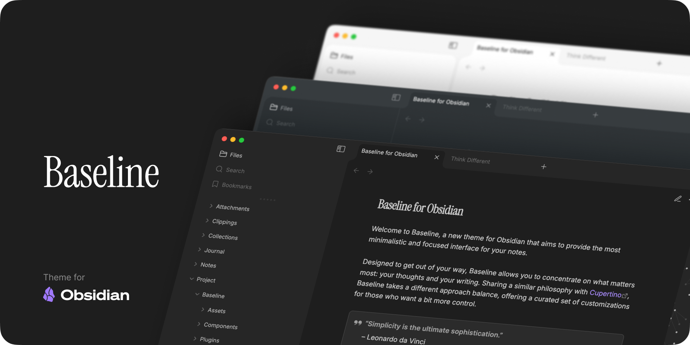
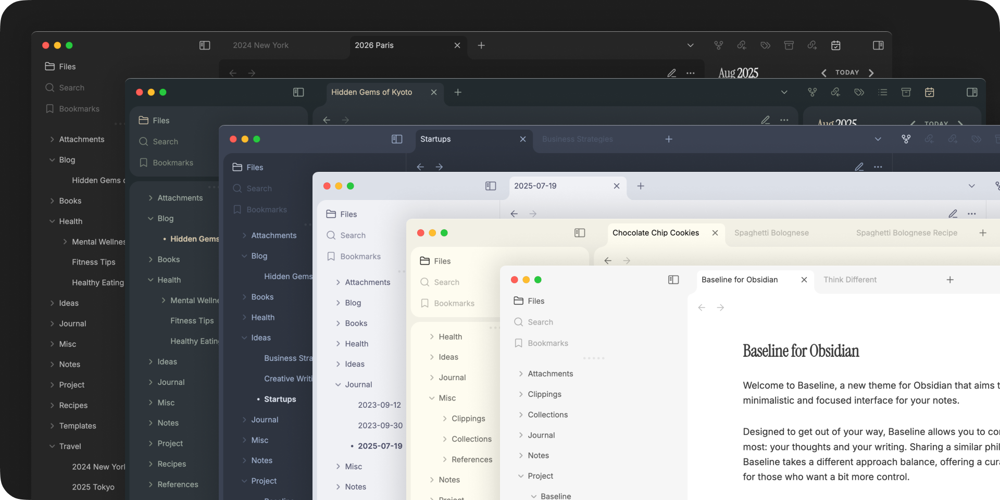
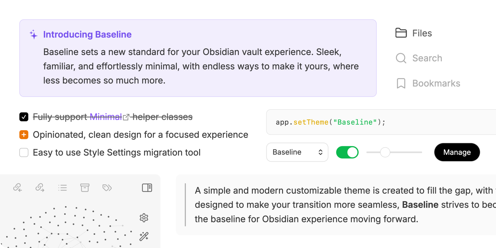
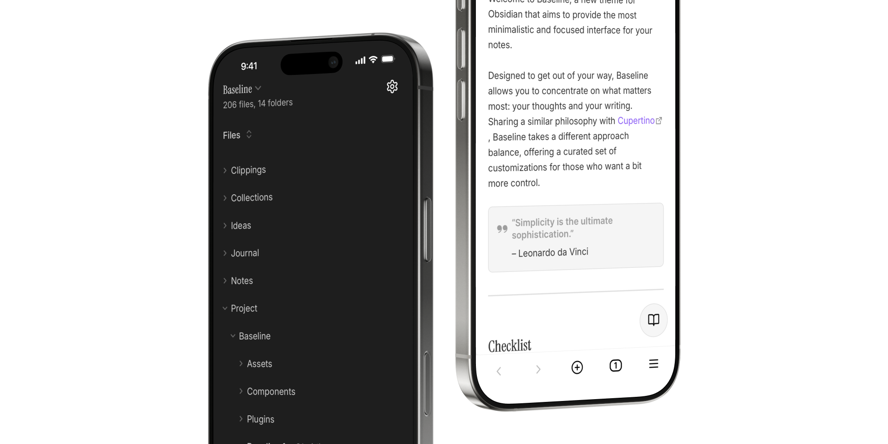

### From the creator of [Cupertino](https://github.com/aaaaalexis/obsidian-cupertino/)

Baseline sets a new standard for your Obsidian vault experience — sleek, familiar, and effortlessly minimal, offering endless ways to make it yours.

[Support me and my work](https://www.buymeacoffee.com/sevenaxis) so I can keep providing regular updates and fixes. You’re also welcome to submit pull requests.

And don’t forget to [support the amazing creators](#credits) who helped shape Baseline.

## Coming from other themes?

Baseline is designed to be a drop-in replacement for your favorite themes. To make your transition seamless, use [Style Settings Migration Tool](https://aaaaalexis.github.io/obsidian-baseline/) to import your settings from following supported themes:

- [Minimal](https://github.com/kepano/obsidian-minimal/) by kepano
- [AnuPpuccin](https://github.com/AnubisNekhet/AnuPpuccin/) by AnubisNekhet
- [Things 2](https://github.com/colineckert/obsidian-things/) by colineckert
- [Border](https://github.com/Akifyss/obsidian-border/) by Akifyss
- [Sanctum](https://github.com/jdanielmourao/obsidian-sanctum/) by jdanielmourao
- ...with more to come.

## Overview

- **Beautifully yours** — Customize your experience to your heart's content with [Style Settings](https://github.com/mgmeyers/obsidian-style-settings).

  

- **Minimal interface** — Clean, organized look and feel, with playful animations and effects.

  

- **Optimized for mobile** — Enhanced navigation, menus, editor, and more, with comfortable spacing for better usability.

  

## Features

### Helper Class

Baseline supports all helper classes (e.g. block width, cards, etc.) from [Minimal](https://github.com/kepano/obsidian-minimal).

Please refer to [minimal.guide](https://minimal.guide) for all available features.

### Customization

Selected features are enabled by default. [Style Settings](https://github.com/mgmeyers/obsidian-style-settings) is **_not_** required.

However, if you prefer to customize your own experience, Baseline provides extensive customization options.

## Philosophy

### Less _and_ more

As software design evolves, Obsidian’s interface is beginning to show its age. Many customizable themes stick too closely to the default look, while more opinionated themes often sacrifice flexibility; or to be blunt, simply don’t look good.

With a clean, modern foundation and endless customization possibilities, Baseline aims to become the starting point, **the baseline for everyone's Obsidian experience**, and for the community going forward.

## Credits

Special thanks to the community for helping make Baseline a reality. Please support them as well!

### Community Themes

- **kepano - [Minimal](https://github.com/kepano/obsidian-minimal)**: Cards, Color schemes, Image filters, Table helpers, Style Settings [Buy them a coffee!](https://buymeacoffee.com/kepano)
- **AnubisNekhet - [AnuPpuccin](https://github.com/AnubisNekhet/AnuPpuccin/)**: Catppuccin color schemes [Buy them a coffee!](https://buymeacoffee.com/anubisnekhet)
- **jdanielmourao - [Sanctum](https://github.com/jdanielmourao/obsidian-sanctum)**: Sanctum color scheme, Elevated element style [Support them!](https://ko-fi.com/X8X56R5Q1)
- **kyffa - [Iridium](https://github.com/kyffa/Iridium)**: Frame layout style
- **vladstudio - [Tiniri](https://tiniri.vlad.studio/)**: Tiniri color scheme [Support them!](https://vlad.studio/signup/)

### Extras

- **Warren2060 - [ChillJinshuSong](https://github.com/Warren2060/ChillJinshuSong)**: Font for extended language support
- **bwya77**: Admin color scheme, Block properties style

## License

Baseline is licensed under the [MIT license](LICENSE). You’re free to take any component of Baseline and build on top of it.
Let’s make a better community by creating amazing themes for everyone!
